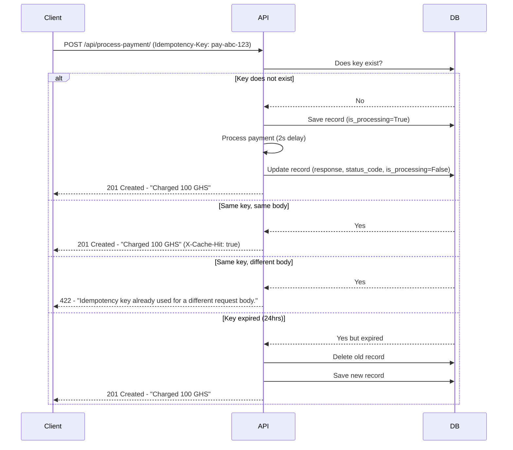

# Idempotency Gateway 🔐

A payment processing API that ensures no matter how many times a client sends the same request, the payment is processed exactly once.

## Architecture Diagram



## Setup Instructions

### Prerequisites
- Python 3.8+
- PostgreSQL

### Installation

1. Clone the repository:
```bash
git clone https://github.com/Dushimimanaprince/AmaliTech-DEG-Project-based-challenges.git
cd AmaliTech-DEG-Project-based-challenges/backend/Idempotency-gateway
```

2. Create and activate virtual environment:
```bash
python -m venv venv
venv\Scripts\activate  # Windows
source venv/bin/activate  # Mac/Linux
```

3. Install dependencies:
```bash
pip install -r requirements.txt
```

4. Configure PostgreSQL in `idempotency_gateway/settings.py`:
```python
DATABASES = {
    'default': {
        'ENGINE': 'django.db.backends.postgresql',
        'NAME': 'your_db_name',
        'USER': 'your_username',
        'PASSWORD': 'your_password',
        'HOST': 'localhost',
        'PORT': '5432',
    }
}
```

5. Run migrations:
```bash
python manage.py migrate
```

6. Start the server:
```bash
python manage.py runserver
```

## API Documentation

### POST `/api/process-payment/`

**Headers:**
| Header | Required | Description |
|---|---|---|
| `Idempotency-Key` | ✅ Yes | Unique string per transaction |
| `Content-Type` | ✅ Yes | Must be `application/json` |

**Request Body:**
```json
{
    "amount": 100,
    "currency": "GHS"
}
```

**Responses:**

| Scenario | Status Code | Response |
|---|---|---|
| New payment | `201 Created` | `{"message": "Charged 100 GHS"}` |
| Duplicate request | `201 Created` + `X-Cache-Hit: true` | `{"message": "Charged 100 GHS"}` |
| Same key different body | `422 Unprocessable Entity` | `{"error": "Idempotency key already used for a different request body."}` |
| Missing key header | `400 Bad Request` | `{"error": "Idempotency-Key header is required"}` |

## Design Decisions

### SHA-256 Hashing
Instead of storing the raw request body, we store a SHA-256 hash. This is faster for comparison, saves storage space and avoids storing raw financial data unnecessarily.

### Threading Lock per Key
Each idempotency key gets its own threading lock. This means simultaneous requests with the same key are handled safely without blocking different keys from being processed in parallel.

### PostgreSQL
Chosen over SQLite for better JSON field support and production readiness.

## Developer's Choice: Key Expiry (24 Hours) ⏰

### What it does
Idempotency keys automatically expire after 24 hours. After expiry, the same key is treated as a brand new request.

### Why it matters
In real Fintech, retries only make sense within minutes of the original request. After 24 hours a reused key is almost certainly a mistake. Keeping keys forever wastes database storage and violates financial data compliance rules. This follows the same standard used by Stripe, the world's largest payment processor.